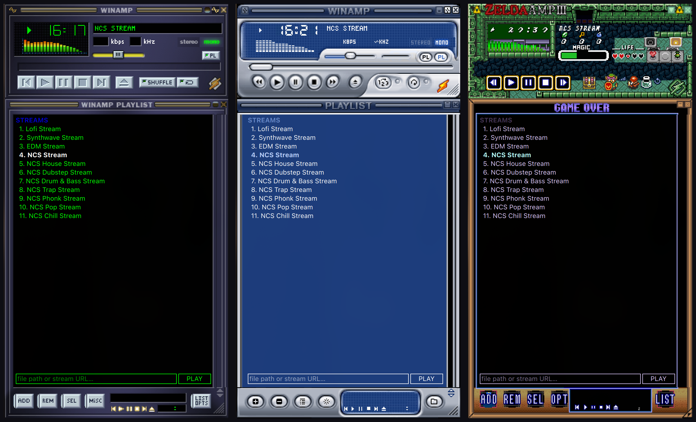
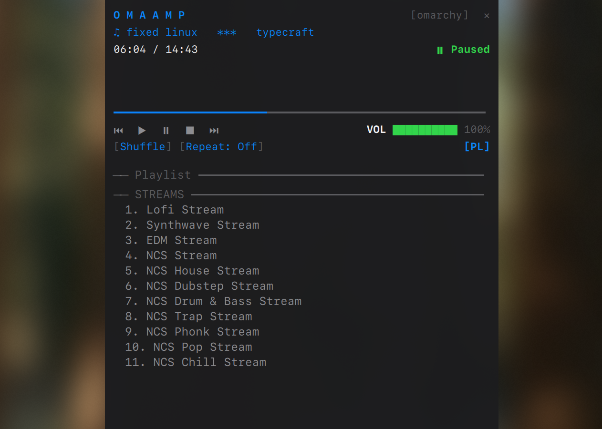
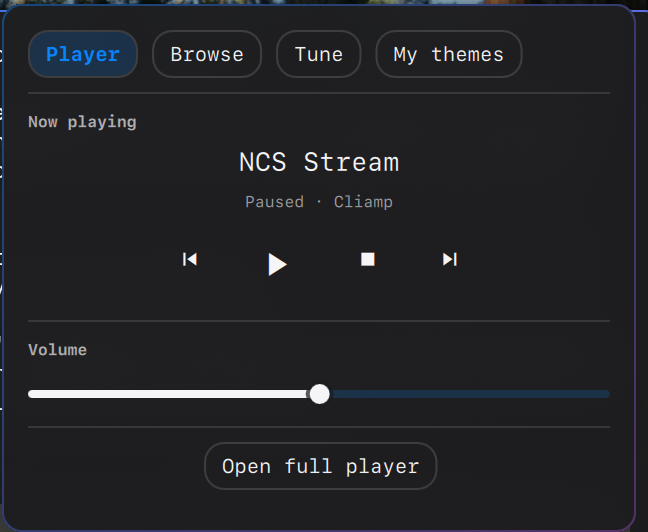

<h1 align="center">OmaAmp</h1>
<p align="center"><b>Like Winamp but on your Omarchy desktop.</b><br>
It really whips the llama's ass — pixel for pixel.<br><br>
  A mini music player in the bar — now playing, transport, volume — and a full-size player you can customize yourself.  The real Winamp 2.x window on your desktop, wearing any of the 102,000
classic skins in the <a href="https://skins.webamp.org/">Winamp Skin
Museum</a>: live spectrum, docked playlist, the works — playing your actual
music over MPRIS, with <a href="https://github.com/bjarneo/cliamp">cliamp</a>
as its headless engine. And themes flow both
ways: any skin becomes a cliamp theme or a full Omarchy desktop theme, and
your Omarchy theme dresses the player right back.</p>

<p align="center">


</p>



*Three classics — base-2.91, Winamp5 Classified, Zelda Amp III — live spectrum
running, each with the docked playlist wearing that skin's own `pledit.bmp`
chrome.*

<p align="center"></p>

*The TUI face: the same player drawn as cliamp draws itself — lines of
monospace text in your Omarchy theme's colors, a `━━━` seek line, a
block-character spectrum, `[Shuffle] [Repeat]` toggles. It recolors on every
`omarchy theme set`, live spectrum and docked playlist included.*

## What you get

- **The player** — the Winamp 2.x main window as a real desktop app,
  rendered sprite-accurately from any museum skin: LCD digits, bitmap-font
  marquee, seek and volume sliders, shuffle/repeat, and a spectrum analyzer
  colored by the skin's own `viscolor.txt`. Hit **PL** and the playlist
  unfolds beneath it in the skin's `pledit.bmp` chrome, exactly like the
  original's snapped-on playlist — pick a stream, load a TOML playlist, or
  paste any file path / stream URL.
- **The bar dropdown** — a native Omarchy panel, the same shape as Wi-Fi and
  Agents, that opens on a **mini music player**: now-playing, transport, and
  volume for whatever is on the bus. The other tabs browse the museum's
  curated top 200 offline (or search all 102k live, as the museum's own
  screenshots), tune colors, and pick themes — one click dresses the player
  *and* writes a matching [cliamp](https://github.com/bjarneo/cliamp)
  terminal theme.

  <p align="center"></p>
- **The theme maker** — turn any skin into a complete Omarchy theme
  (`colors.toml` + a rendered wallpaper), which Omarchy's template engine
  fans out to your terminal, editor, browser and bar. One Winamp skin themes
  the whole desktop.
- **cliamp integration** — OmaAmp is an MPRIS client (cliamp-first, but it
  drives Spotify, Chromium or mpv too). Opening the player starts a headless
  `cliamp -d` engine when nothing is running, and closing it stops the
  engine it started — closing Winamp stopped the music. A shipped
  `cliamp.toml.tpl` + theme-set hook also makes cliamp follow every Omarchy
  theme switch, like the rest of the themed apps.

## Install

The bar widget installs like any Omarchy plugin:

```bash
omarchy plugin add https://github.com/jonnyace/omaamp.git
omarchy plugin enable io.github.jonnyace.omaamp
```

The desktop app is opt-in, from the plugin checkout:

```bash
cd ~/.config/omarchy/plugins/io.github.jonnyace.omaamp
./install.sh          # `omaamp` on PATH, a launcher tile, Hyprland rules,
                      # the cliamp theme template + hook
```

`install.sh` appends one clearly marked, backed-up rule block to
`~/.config/hypr/hyprland.lua`; `./install.sh --uninstall` removes everything
it added. Skins download on demand and cache under `~/.cache/omaamp/`;
museum entries flagged NSFW are filtered from browse and search.

## Use

- **Bar icon**: left-click opens the skin browser, middle-click launches or
  focuses the player.
- **Browser panel**: *Browse* is the museum's own top ranking (cached,
  offline); typing searches everything. Clicking a skin re-dresses a running
  player live. If opening a skin from the museum does not hand off to OmaAmp,
  paste its `skins.webamp.org/skin/…` link into the fallback field. *Tune*
  edits the seven derived cliamp colors — live, when the
  player wears the TUI face — and holds the **Make Omarchy theme** /
  **Apply to desktop** buttons. It also switches the player between its
  adaptive enlarged scale and the original 275×116
  one-physical-pixel-per-skin-pixel size. *My themes* lists installed cliamp
  themes; picking one dresses the TUI player and cliamp together.
- **Player**: opens as its own tile (never hovering over your windows),
  scales in whole-pixel steps up to Winamp's classic double-size, floats
  when you toggle it. The letterbox is transparent — wallpaper shows through
  around the artwork. With the playlist open, scaling fits the complete docked
  stack rather than letting the lower pane escape a short tile. Drag the
  playlist's lower-right corner to resize it in classic 29-pixel steps; its
  open state and preferred height survive restarts. Drop a local `.wsz` or
  `.zip` skin anywhere on the window to install and wear it. Skins with a
  classic `region.txt` keep their cut-out, transparent main-window shape.
- **Following your Omarchy theme**: museum skins are bitmap art — they keep
  their own colors and do **not** recolor when you switch Omarchy themes.
  Two ways to get a player that matches your desktop:
  - **My themes** tab: pick any cliamp theme and the player wears the
    **TUI face** — the same 275x116 player drawn as text from the theme's
    seven colors, laid out like cliamp's own screen: no buttons or boxes,
    just glyph transport, a heavy-line seek bar and bracketed toggles.
    Because it is color-driven, the *Tune* tab recolors it live, and it is
    the default face for themes.
  - **Sync to Omarchy theme**: generates a synthetic bitmap skin — the
    classic Winamp art recolored through your live palette — rebuilt by the
    theme-set hook on every `omarchy theme set` while worn.

  Pick any museum skin in *Browse* to go back to fixed bitmap art.

```bash
omaamp                  # launch, or focus the running instance
omaamp --skin <id-link-or-file>  # museum md5/link or a local .wsz/.zip
omaamp --zoom 3         # bigger pixels
omaamp --no-engine      # don't start a cliamp daemon
omaamp --quit
```

## How it works

**Rendering.** A `.wsz` is a ZIP of sprite sheets cut to fixed offsets
(`main.bmp` 275×116, `cbuttons.bmp` 136×36, `text.bmp` 155×18 …). Those
offsets are not ours to choose — every skin ever made was cut against them —
so `player/sprites.js` encodes the classic spec and nothing else. Surveying
280 skins (~1,900 sheets), Qt decodes 99.6% natively; 15.7% ship
`nums_ex.bmp` instead of `numbers.bmp`, which shifts every digit one cell.

**Why the player is its own process.** It would be less code as an
omarchy-shell plugin, but plugins run unsandboxed inside the single process
that owns the bar, notifications and lock screen — and this program's job is
decoding bitmaps from arbitrary archives, ~0.4% of which have corrupt
headers. As an app, a decoder fault closes a music player. Measured marginal
cost: ~117 MB PSS (most of Qt is already resident for the shell).

**The cliamp boundary.** OmaAmp is presentation and desktop integration on
top of cliamp, not a second player engine. cliamp owns decoding, playback,
its queue, spectrum samples and terminal configuration; OmaAmp talks through
MPRIS, `visstream`, and the documented local socket. Generic MPRIS players
still get transport controls, but cliamp-only capabilities stay conditional.
New playback behavior belongs upstream in cliamp and is surfaced here only
after cliamp exposes it—OmaAmp does not grow a parallel decoder, queue or EQ.

**Theme conversion.** Winamp drew its colors over its own artwork; a
terminal draws them on a flat background, so a literal port leaves a large
share of the museum unreadable. The converter (`cliamp_skinner/`) works in
OKLab: backgrounds get lightness headroom while keeping their hue, monochrome
visualizer ramps are re-laid across a contrast-safe band, fade-to-black steps
borrow the ramp's hue instead of surfacing grey, and polychrome ramps —
including Winamp's own red/yellow/green — are left alone, because their
non-monotonic lightness *is* the look. On 200 randomly sampled skins the
result is 98.5% clean; the residual is two-color skins where "collapsed" is
the honest answer. `python3 -m unittest discover -s tools` runs the
regression suite; `tools/bench.py` re-runs the corpus harness.


## Layout

    player/            the app (self-contained Quickshell config)
    BarWidget.qml
    Panel.qml          the bar plugin
    bin/omaamp         launcher: engine lifecycle, launch-or-focus
    bin/skinner        JSON bridge: museum, conversion, playback, themes
    cliamp_skinner/    the OKLab conversion engine (stdlib-only Python)
    install.sh         desktop-app install / uninstall
    assets/            cliamp theme template + theme-set hook
    tools/             dev tooling: corpus bench, CLI converter, tests

## License

MIT.
